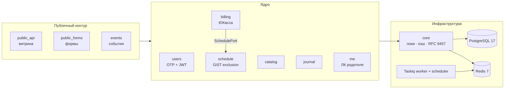

# Улица Радости — Backend

Бэкенд детского центра развития: расписание кружков, абонементы с онлайн-оплатой, журнал посещаемости, личный кабинет родителя, публичная витрина и админ-панель для менеджеров.


## Возможности

- **Абонементы и оплата** — чекаут через ЮКассу с полной идемпотентностью (Idempotence-Key, claim-check с lease в БД), депозиты, автоматические возвраты, свиперы протухших броней
- **Расписание без коллизий** — пересечения преподавателей и кабинетов исключены на уровне СУБД (GiST exclusion constraints), переносы и отмены занятий через маски
- **Журнал посещаемости** — автоматическая материализация занятий, списание/возврат «фишек» абонемента одной транзакцией
- **Вход без паролей** — OTP-код на email, JWT, защита от перебора и энумерации
- **Публичная витрина** — кэшируемые read-only проекции с бюджетом в 2 SQL-запроса на эндпоинт
- **Антиспам форм** — капча, honeypot, троттлинг по IP и email за прокси

## Стек

| Слой | Технологии |
|---|---|
| Ядро | Python 3.12, Django 6, Django REST Framework |
| Данные | PostgreSQL 17 (advisory locks, триггеры, btree_gist), Redis 7 |
| Фоновые задачи | Taskiq поверх Redis Streams — at-least-once, consumer groups |
| API | drf-spectacular (OpenAPI 3.1), ошибки по RFC 9457 |
| Медиа | S3-совместимое хранилище (django-storages / boto3) |
| Качество | uv, Ruff, mypy (strict), pytest + Factory Boy |

## Архитектура

Модульный монолит: каждое приложение в `apps/` — изолированный домен. Модели держат только состояние и простые инварианты, сериализаторы — только трансформацию, вся бизнес-логика живёт в `services.py` домена. Кросс-доменные вызовы в биллинге идут через порт (`ports.py`), а не через импорт чужих моделей.



| Домен | Ответственность |
|---|---|
| `users` | родители, дети, OTP-аутентификация по email (JWT) |
| `catalog` | кружки и категории |
| `schedule` | недельная сетка, переносы/отмены, контроль коллизий |
| `billing` | абонементы, чекаут ЮКассы, фишки занятий, депозиты, возвраты |
| `journal` | журнал занятий и посещаемость для преподавателей |
| `events` | разовые события с гостевой регистрацией |
| `public_api` / `public_forms` | витрина и публичные формы |
| `me` | личный кабинет родителя |
| `core` | advisory-локи, кэширование, обработчик ошибок, dashboard |

## Быстрый старт

Требуются [uv](https://docs.astral.sh/uv/) и Docker.

```bash
cp .env.example .env        # заполнить SECRET_KEY и пароль БД
docker compose up --build
```

Поднимутся Postgres, Redis, backend (миграции применяются на старте), Taskiq-воркер и шедулер cron-задач.

| Сервис | URL |
|---|---|
| API | http://localhost:8000 |
| Swagger UI | http://localhost:8000/api/schema/swagger-ui/ |
| Админка | http://localhost:8000/admin/ |

<details>
<summary>Локальная разработка без контейнеров</summary>

Postgres и Redis должны быть доступны по адресам из `.env`:

```bash
uv sync
uv run manage.py migrate
uv run manage.py createsuperuser
uv run manage.py runserver
```

Фоновые воркеры — отдельными процессами:

```bash
uv run taskiq worker config.worker:broker --workers 2
uv run taskiq scheduler config.worker:scheduler
```

</details>

## Проверки качества

Все проверки одной командой — ruff, формат, mypy, забытые миграции и pytest:

```bash
uv run python scripts/check.py          # всё, перед PR
uv run python scripts/check.py --fast   # без pytest, за секунды
uv run python scripts/check.py --fix    # ruff сам чинит и форматирует
```

Шаги идут до конца, в итоге — таблица OK/FAIL; код выхода 1, если что-то упало.

Хук перед коммитом (ruff, формат, mypy, проверка миграций при правке моделей) ставится один раз:

```bash
uv run pre-commit install
```

Хуки берут ruff и mypy из `uv.lock`, поэтому проверяют ровно то же, что и ручной запуск.

Тесты гоняются на реальном Postgres — advisory-локи, триггеры и exclusion-констрейнты проверяются на живой БД, а не на моках. Данные генерируются только через Factory Boy.

## Надёжность фоновых задач

Брокер — Redis Streams с consumer group: сообщение подтверждается (XACK) только после успешного выполнения, зависшие сообщения убитых воркеров переподхватываются через XAUTOCLAIM. Все задачи идемпотентны, повторная доставка безопасна. Финансовые операции дополнительно защищены Idempotence-Key провайдера и claim-check-резервацией в БД — двойное списание или двойной возврат исключены даже при дубле крона и падении воркера посреди сетевого вызова.

## Документация API

OpenAPI-схема: `GET /api/schema/` (JSON), интерактивная — `/api/schema/swagger-ui/`. Ошибки следуют RFC 9457 (Problem Details): машиночитаемый `type`, `request_id` для трассировки, `invalid_params` с перечнем полей при 422.
