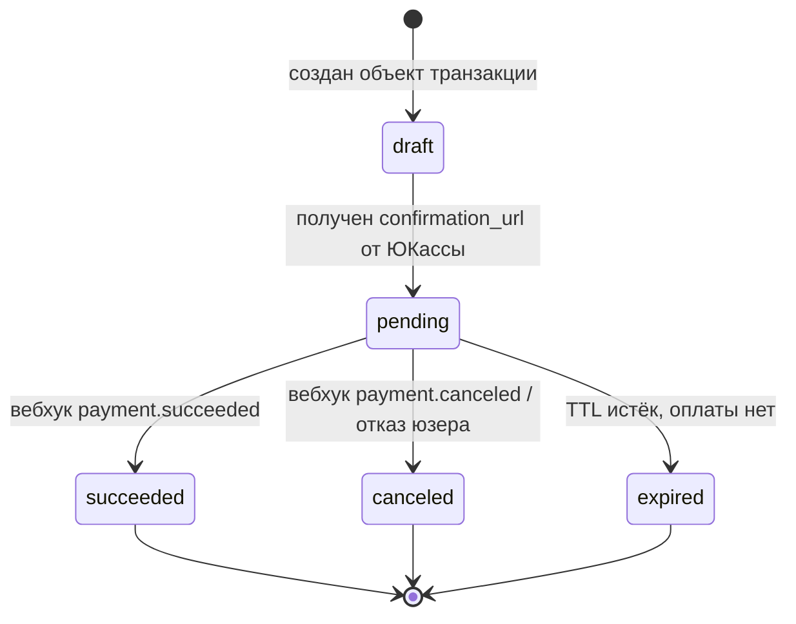
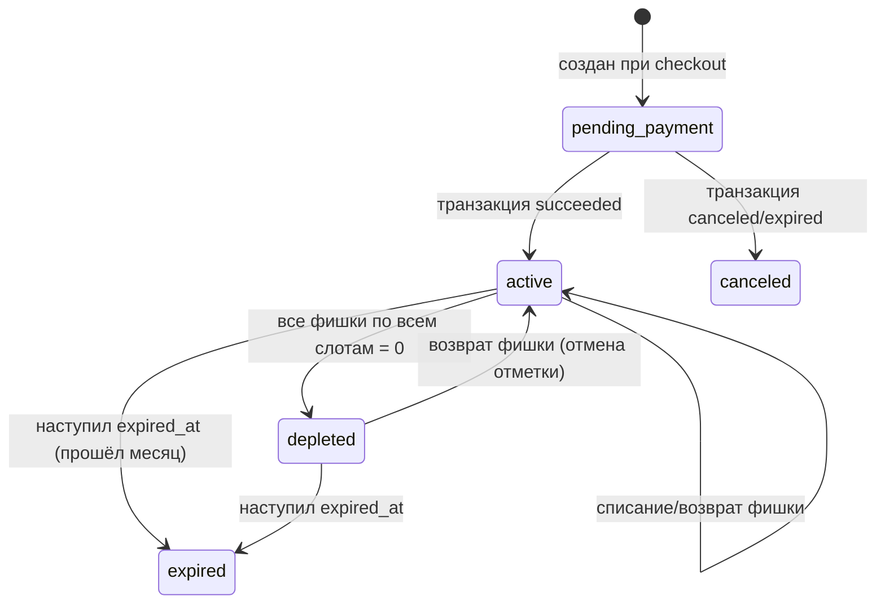
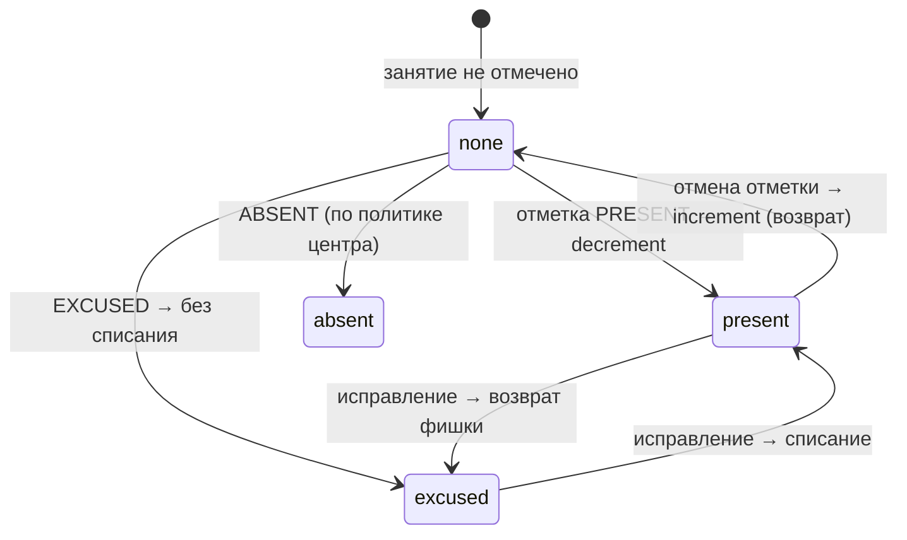

# Технический аудит схемы БД «Улица Радости» — Шаги 1–4

> **Назначение.** Диагностика текущей схемы и проектные решения: стейт-машины,
> возможности PostgreSQL, слои DRF, расписание × маски (Шаги 1–4 ТЗ).
> **Статус.** Архив — диагностика проектной схемы (`schema-legacy.md`). Все замечания
> P0 и P1 закрыты реализацией: subscription_slot с фишками, HELD-бронь, уникальный
> external_id, стейт-машины статусов, exclusion-констрейнты и кабинеты — см. `schema.md`.
> **Связанные документы.** Разбираемая здесь схема — `schema-legacy.md`; актуальная —
> `schema.md`; бизнес-контекст — `project-context.md`.

---

## 0. Резюме и карта рисков

Схема покрывает каркас (люди, расписание, биллинг), но в ней не выражены **три
несущие бизнес-механики**: «4 фишки на конкретный слот», транзакционное списание
фишки в журнале и блокировка места до подтверждения оплаты. Это не косметика —
без них ломаются деньги и вместимость групп.

| #   | Проблема                                                                                                                                                    | Серьёзность | Где разбирается |
| --- | ------------------------------------------------------------------------------------------------------------------------------------------------------------------- | ---------------------- | ----------------------------- |
| R1  | Баланс считается по `activity`, а не по слоту → правило «4 фишки/слот» невыразимо                         | P0                  | Шаг 1.2, 1.3, 4            |
| R2  | `enrollment` не несёт `subscription_id` → нечем привязать списание к абонементу                                        | P0                  | Шаг 1.3, 3                 |
| R3  | `attendance` не связан с источником списания (enrollment/balance)                                                                      | P0                  | Шаг 1.3                    |
| R4  | Место занимается активным `enrollment`, который создаётся до оплаты → гонка, перепродажа мест | P0                  | Шаг 1.1                    |
| R5  | `external_payment_id` не уникален → вебхук ЮКассы не идемпотентен, двойное списание                           | P0                  | Шаг 1.1, 2                 |
| R6  | Нет состояний `pending_payment` / `depleted` у абонемента и `expired` у транзакции                                         | P1                  | Шаг 1.1, 1.2               |
| R7  | Нет ограничения «1 пробное на ребёнка на кружок» на уровне БД                                                     | P1                  | Шаг 2.3                    |
| R8  | Нет защиты от пересечения времени учителя/кабинета; нет сущности «кабинет»                          | P1                  | Шаг 2.3                    |
| R9  | `schedule_mask.RESCHEDULE` меняет только время, не день/кабинет                                                                     | P2                  | Шаг 4                      |
| R10 | «Прочие услуги» (SERVICE) и метаданные ЮКассы не имеют места под гибкие поля → JSONB                       | P2                  | Шаг 2.1                    |
| R11 | Разнобой денег и отсутствие `generated`-полей (цена со скидкой, остаток мест)                                | P2                  | Шаг 2.2                    |

Условные обозначения: P0 — блокирует корректную работу денег/мест; P1 —
целостность данных под угрозой при росте нагрузки; P2 — удобство/расширяемость.

---

## Шаг 1. Управление состояниями (State Machine Analysis)

### 1.1. Transaction (платёж в ЮКассе)

Текущая схема: `status ∈ {PENDING, SUCCEEDED, CANCELLED}`. Этого мало: нет
терминального «протух» и нет защиты от повторной обработки вебхука.

**Целевой автомат:**



| Переход           | Триггер                                             | Валидация / эффект                                                                                                                                                                                                 |
| ------------------------ | ---------------------------------------------------------- | --------------------------------------------------------------------------------------------------------------------------------------------------------------------------------------------------------------------------------- |
| `draft → pending`     | Успешный `Payment.create` в ЮКассе        | Сохранить `external_payment_id`; создать связанную бронь места (`enrollment.status = HELD`)                                                                                                |
| `pending → succeeded` | Вебхук `payment.succeeded`                         | **Идемпотентность**: обработать только если текущий статус `pending`; перевести бронь `HELD → REGULAR`, абонемент `pending_payment → active` |
| `pending → canceled`  | Вебхук `payment.canceled`                          | Снять бронь (`HELD → удалить/CANCELLED`), вернуть место в пул                                                                                                                                 |
| `pending → expired`   | Фоновая задача по TTL (напр. 15 мин) | То же, что canceled, но причина — таймаут                                                                                                                                                                 |

**Как предотвратить двойное списание.** Два независимых барьера:

1. `external_payment_id UNIQUE` — повторный вебхук с тем же id отлетает на уровне БД.
2. Переход выполняется атомарно и только из `pending`:
   `UPDATE transaction SET status='succeeded' WHERE id=%s AND status='pending'`.
   Если затронуто 0 строк — событие уже обработано, выходим (идемпотентный no-op).

**Как блокировать место до подтверждения.** Нельзя считать вместимость по «оплаченным»
записям — тогда между «создал платёж» и «пришёл вебхук» место смогут перекупить.
Решение: место занимает запись со статусом брони (`HELD`) сразу при `draft → pending`,
с TTL. Счётчик «занято» = `REGULAR + HELD (не протухшие)`. Это закрывает R4.

### 1.2. Subscription (абонемент)

Текущая схема: `status ∈ {ACTIVE, PENDING_REFUND, COMPLETED}` — путает оплату,
исчерпание и возврат. Нужно разделить ось «оплата» и ось «расход фишек».



| Переход                | Триггер                                                      | Правило валидации                                                                                                                           |
| ----------------------------- | ------------------------------------------------------------------- | ----------------------------------------------------------------------------------------------------------------------------------------------------------- |
| `pending_payment → active` | Транзакция `succeeded`                                  | Только если есть оплаченная транзакция; зафиксировать `start_date`, `expired_at = start_date + 1 мес` |
| `active → depleted`        | Сумма `remaining` по всем `subscription_balance` = 0 | Вычисляется после каждого списания                                                                                           |
| `active                       | depleted → expired`                                                | `today > expired_at`                                                                                                                                      |
| `depleted → active`        | Возврат фишки (отмена отметки)             | Разрешён только пока `today ≤ expired_at`                                                                                              |

`expired` и `depleted` — разные вещи: `depleted` (фишки кончились) обратим возвратом
отметки, `expired` (вышел месяц) — нет. Текущий единый `COMPLETED` это не различает (R6).

### 1.3. Списание посещений («фишки»)

Это самая хрупкая операция: пересекаются журнал, баланс и абонемент. Требование —
отметка `PRESENT` списывает **одну** фишку, а ошибочную отметку («перепутали ребёнка»)
можно откатить с возвратом фишки.



**Откуда списывать (закрывает R1–R3).** Чтобы списание было детерминированным,
у отметки должен быть однозначный «адрес» фишки. Сейчас его нет: `attendance`
ссылается только на `student + schedule + date`, а баланс лежит по `activity`.
Нужна цепочка `attendance → enrollment → subscription_balance`, где
`subscription_balance` ведётся **по слоту** (или по паре абонемент+слот), а не по `activity`.

**Транзакционность.** Списание и возврат — критическая секция:

```sql
BEGIN;
SELECT remaining FROM subscription_balance WHERE id = %s FOR UPDATE;  -- блокируем строку
UPDATE subscription_balance SET remaining = remaining - 1
 WHERE id = %s AND remaining > 0;                                     -- CHECK не даст < 0
INSERT INTO attendance (...) VALUES (...);                            -- факт отметки
COMMIT;
```

- `FOR UPDATE` сериализует параллельные отметки по одной фишке.
- `CHECK (remaining >= 0)` — последний рубеж от ухода в минус.
- Возврат — симметричный `remaining + 1` в той же критической секции при удалении/смене отметки.
- Идемпотентность отметки гарантирует `UniqueConstraint(student, slot, date)`: повторная
  отметка не создаст вторую фишку-списание.

---

## Шаг 2. Специфичные возможности PostgreSQL

### 2.1. JSONB

| Кандидат                                                                                                | JSONB оправдан? | Обоснование                                                                                                                                                                                                                                            |
| --------------------------------------------------------------------------------------------------------------- | ----------------------- | ----------------------------------------------------------------------------------------------------------------------------------------------------------------------------------------------------------------------------------------------------------------- |
| Метаданные транзакции ЮКассы (`payment_method`, `receipt`, сырой ответ) | Да                 | Структура диктуется внешним провайдером и меняется без нашего ведома. Хранить в `transaction.metadata JSONB`, индексировать при необходимости через GIN.  |
| Параметры «прочих услуг» (SERVICE)                                                        | Да                 | По ТЗ — слабоструктурированные сущности (консультация, продажа книг).`activity.params JSONB` даёт расширяемость без ALTER TABLE на каждый новый тип услуги. |
| Системные настройки (settings)                                                                | Да                 | Классический «мешок ключей-значений», читается редко.                                                                                                                                                               |
| Баланс, цены, статусы, расписание                                                    | Нет               | Это реляционное ядро: участвует в JOIN, агрегатах, constraints. JSONB убьёт целостность и индексы.                                                                                                   |

Правило: **JSONB — для данных на периферии, чья форма нестабильна или внешняя.**
Всё, что участвует в деньгах, вместимости и связях — строгие колонки.

### 2.2. Generated Columns (вычисляемые поля)

| Поле                                                         | Тип generated           | Комментарий                                                                                                                                                                                                                                            |
| ---------------------------------------------------------------- | -------------------------- | ----------------------------------------------------------------------------------------------------------------------------------------------------------------------------------------------------------------------------------------------------------------- |
| `event_registration.amount`                                    | STORED                     | `price * attendees_count` — убирает риск рассинхрона цены и суммы (сейчас «бэк считает», т.е. на доверии к коду).                                                                            |
| Цена тарифа со скидкой /`price_per_session` | С оговоркой | Если скидка зависит только от полей строки — STORED уместно. Если от внешней акции — это уже не свойство строки, считать в сервисе.                           |
| Остаток мест в группе                          | Не generated          | Зависит от**другой** таблицы (`enrollment`), а generated-колонка не может ссылаться на другие строки. Считать оконным запросом/подзапросом (см. Шаг 4). |

Вывод: generated-колонки хороши для производных **в пределах одной строки**
(`amount = price * count`). Кросс-табличные агрегаты (вместимость) — нет.

### 2.3. Ограничения БД (Constraints)

**«Максимум 1 пробное на ребёнка на кружок».** Пробное — это `enrollment` с
`type = TRIAL`. Уникальность должна срабатывать только для пробных, поэтому —
**partial unique index**:

```python
UniqueConstraint(
    fields=["student", "activity"],          # кружок, а не конкретный слот
    condition=Q(type="TRIAL"),
    name="uniq_trial_per_student_per_activity",
)
```

Нюанс: `enrollment` сейчас ссылается на `schedule` (слот), а ограничение нужно по
`activity` (кружок). Значит для пробного нужен доступ к `activity` — либо денормализовать
`activity_id` в `enrollment`, либо вынести ограничение в `model.clean()` с проверкой
через JOIN (менее надёжно при гонках). Рекомендую денормализацию — см. Шаг 5.

**Пересечение времени учителей (ExclusionConstraint).** Расписание
абсолютное (день недели + время), поэтому пересечение определяется парой
`(day_of_week, [start_time, end_time))`. PostgreSQL это умеет через `btree_gist`:

```python
# requires: CREATE EXTENSION btree_gist;
ExclusionConstraint(
    name="no_teacher_time_overlap",
    expressions=[
        ("teacher", RangeOperators.EQUAL),
        ("day_of_week", RangeOperators.EQUAL),
        (TsTzRange("start_time", "end_time"), RangeOperators.OVERLAPS),
    ],
)
```

Это переносит инвариант
«один учитель не может вести две группы одновременно» из кода в БД (закрывает R8).
Подгруппы это не ломает: разные подгруппы — это разные слоты с **разным** временем
или разным учителем, пересечения у них нет.

---

## Шаг 3. Разделение логики по слоям (DRF)

Принцип: **чем дороже ошибка, тем ниже её проверка.** Деньги и вместимость — на
уровне БД; форматы и UX — в сериализаторах; оркестрация — в сервисах.

### 3.1. Слой моделей (`models.py`) — DB Constraints + `clean()`

На уровне **БД-ограничений** (защита от гонок, обязательна):

- `CHECK (remaining >= 0)` — баланс не уходит в минус.
- `UNIQUE (external_payment_id)` — идемпотентность вебхука.
- `UNIQUE (student, slot, date)` — одна отметка на занятие.
- partial `UNIQUE` пробного; `ExclusionConstraint` на пересечения.

На уровне **`model.clean()`** (бизнес-инварианты строки, не критичные к гонкам):

- `RESCHEDULE` требует `new_start_time`, `CANCELLATION` — запрещает его.
- `type=TRIAL` требует `trial_date`; `type=REGULAR` — запрещает.
- `end_time > start_time` у слота.

### 3.2. Слой сериализаторов (`serializers.py`)

- **Валидация покупки** (метод `validate`): слот активен; есть свободные места
  (`REGULAR + HELD < max_capacity`); для пробного — ребёнок ещё не брал пробное по
  этому кружку; для абонемента — выбранные слоты не конфликтуют по времени между собой.
- **Writable nested «родитель + дети»**: при checkout гостя создаём `parent` и
  `student` в одной БД-транзакции. Переопределить `create()` сериализатора, обернуть
  в `transaction.atomic()`; при `student_id=null` создавать ребёнка, иначе брать
  существующего и проверять, что он принадлежит этому родителю (приватность из ТЗ).
- Сериализатор **не** трогает баланс/платежи — только валидирует и нормализует вход.

### 3.3. Слой сервисов (`services.py`)

Сюда выносится всё, что охватывает несколько таблиц или внешний мир:

- **Генерация виртуального календаря**: из абсолютных слотов + масок собрать
  конкретные даты для «Ближайшие активности» в ЛК (Шаг 4).
- **Процессинг вебхуков ЮКассы**: идемпотентный перевод статусов transaction →
  subscription → enrollment (Шаг 1.1).
- **Списание/возврат фишек**: критическая секция из Шага 1.3.
- **Checkout-флоу**: создание parent/student/subscription/balance/transaction +
  обращение к ЮКассе + (для гостя) генерация Magic Link.

Вьюсеты остаются тонкими: разбор запроса → вызов сервиса → сериализация ответа.

---

## Шаг 4. Абсолютное расписание × Маски переноса

### Суть проблемы

Слот (`time_slot`/`schedule`) живёт в «днях недели без дат», а журнал (`attendance`)
и маски (`schedule_mask`) — в конкретных календарных датах. Нужно спроецировать
абсолютные слоты на диапазон дат, наложить маски и не словить N+1.

### Модель связи

- `schedule` (слот) — шаблон: «ПН 16:00–17:00, КМ, группа Общая».
- `schedule_mask` — точечное переопределение конкретной даты (отмена/перенос).
- При раскрытии недели: для каждого слота генерируем дату; если на эту дату есть
  активная маска — применяем (скрываем при `CANCELLATION`, сдвигаем время при `RESCHEDULE`).

### Недельная сетка со счётчиком занято/всего (публичная страница)

Счётчик «занято» = число активных `enrollment` на слот. Это кросс-табличный агрегат,
поэтому — аннотация, а не generated-колонка:

```python
slots = (
    WeeklySlot.objects
    .filter(is_active=True, activity__is_active=True)
    .select_related("activity", "teacher")          # FK → один JOIN, без N+1
    .annotate(
        capacity_current=Count(
            "enrollments",
            filter=Q(enrollments__is_active=True),   # HELD тоже считаем при бронировании
        )
    )
    .order_by("day_of_week", "start_time")
)
```

Фронт сам раскидывает плоский список по колонкам дней (по `day_of_week`) — как в
`api-contracts-legacy.md §3`. Один запрос на всю сетку.

### «Ближайшие активности» в ЛК (даты + маски, без N+1)

```python
enrollments = (
    Enrollment.objects
    .filter(student__parent=parent, is_active=True)
    .select_related("slot__activity", "slot__teacher", "subscription")
    .prefetch_related(
        Prefetch(
            "slot__exceptions",
            queryset=ScheduleException.objects.filter(date__range=(today, horizon)),
            to_attr="masks_in_range",
        )
    )
)
```

Дальше в сервисе разворачиваем каждую запись в конкретные даты на горизонте
(4 недели для абонемента), для каждой даты проверяем `masks_in_range`:
`CANCELLATION` — пропускаем дату, `RESCHEDULE` — подменяем время и ставим
`is_rescheduled=true` (поле из контракта `§4`). `Prefetch` с фильтром по диапазону
дат гарантирует один доп. запрос на все маски вместо запроса на каждую запись.

### Эскиз SQL недельной сетки (если нужен сырой запрос)

```sql
SELECT s.id, s.day_of_week, s.start_time, s.end_time,
       a.name AS activity_name, a.slug,
       s.max_capacity,
       COUNT(e.id) FILTER (WHERE e.is_active) AS capacity_current
FROM schedule s
JOIN activity a ON a.id = s.activity_id AND a.is_active
LEFT JOIN enrollment e ON e.schedule_id = s.id
WHERE s.is_active
GROUP BY s.id, a.name, a.slug
ORDER BY s.day_of_week, s.start_time;
```

Замечание по R9: `RESCHEDULE` хранит только `new_start_time`. Перенос на **другой
день недели** или в **другой кабинет** так не выразить — см. Шаг 5.

---

## Приложение. Таблица трассировки покрытия

Проверка, что каждый шаг ТЗ и каждая бизнес-фича `project-context.md` адресованы.

| Шаг ТЗ                           | Раздел отчёта |
| ------------------------------------- | ------------------------- |
| 1. State Machines                     | Шаг 1.1–1.3           |
| 2. Возможности PostgreSQL  | Шаг 2.1–2.3           |
| 3. Слои DRF                       | Шаг 3.1–3.3           |
| 4. Расписание × маски | Шаг 4                  |
| 5. Рефакторинг             | `schema-refactoring.md` |

| Бизнес-фича (project-context)                                                 | Где учтена                                 |
| --------------------------------------------------------------------------------------- | --------------------------------------------------- |
| 1. Кружки + абсолютное расписание + прочие услуги | Шаг 2.1 (SERVICE/JSONB), Шаг 4                |
| 2. Родители, абонементы/пробные, приватность ЛК   | Шаг 3.2 (приватность), Шаг 1.3     |
| 3. Абонемент = слоты, 4 фишки, 1 месяц                          | Шаг 1.2, 1.3, R1                                 |
| 4. Пробные на конкретную дату+слот, 1/ребёнка         | Шаг 2.3 (partial unique)                         |
| 5. Ивенты, анонимная запись, оплата за места          | Шаг 2.2 (amount generated)                       |
| 6. Галерея                                                                       | вне рисков (простая таблица) |
| 7. Учителя                                                                       | Шаг 2.3 (пересечения времени)  |
| 8. Сбор данных (lead_source, комментарий)                          | Шаг 2.1, refactoring                             |
| 9. Тарифы, разовая покупка (не подписка)                  | Шаг 1.1, 1.2                                     |
| 10. Маска переноса                                                         | Шаг 4, R9                                        |
| 11. Топ-3 кружка на главной                                           | `is_featured` — есть в схеме           |
| 12. Подгруппы как отдельные слоты                             | Шаг 2.3 (не ломают ExclusionConstraint)  |
| 13. ЮКасса через redirect + вебхуки                                   | Шаг 1.1, Шаг 3.3                              |
