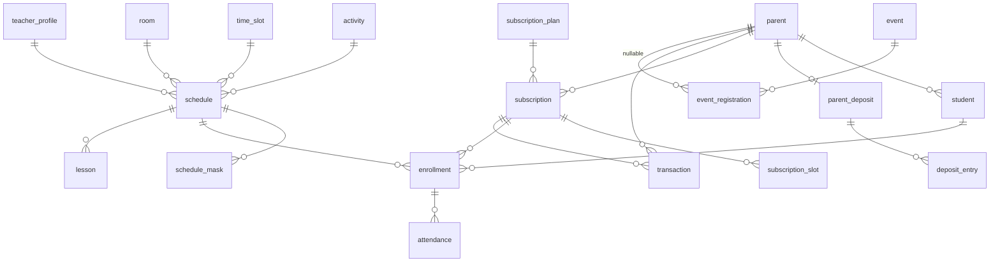

# «Улица Радости» — Схема базы данных

> **Назначение.** Текущая структура данных по доменам: ключевые поля, связи, инварианты уровня СУБД.
> **Статус.** Актуальный — соответствует реализации. Детальный источник истины — модели
> в `apps/*/models.py` и миграции; при расхождении прав код, а этот документ чинится.
> Проектная (дореализационная) версия схемы — `schema-legacy.md`.
> **Связанные документы.** `schema-audit.md` (исходная диагностика), `schema-refactoring.md`
> (план, по которому это строилось), `project-context.md`.

Деньги везде в копейках (integer). День недели: 0 = Пн … 6 = Вс.

---

## users — люди и вход

**parent** — кастомная модель пользователя (AUTH_USER_MODEL). `email` (unique, логин),
`full_name`, `phone` (PhoneNumberField), `comments`, `is_active`, `is_staff`. Паролей у
родителей нет (unusable password), пароль есть только у staff для входа в админку.

**student** — `parent` FK (CASCADE), `full_name`, `school_grade`, `dob`, `health_issues`.
Уникальность `(parent, full_name, dob)` — защита от дабл-сабмита формы.

**magic_tokens** — OTP-коды входа: `email`, `code` (6 цифр), `attempts_count`,
`expires_at`, `is_used`. Составные индексы `(is_used, expires_at)` и
`(email, -created_at)` под выборку последнего кода и чистку протухших.

**teacher_profile** — 1:1 к пользователю: `middle_name`, `photo_url`, `position`,
`quote`, `bio`.

## catalog

**activity** — кружок/услуга: `name`, `slug` (unique), `category`, `price`,
`cover_image`, `short_description`, `description`, `features` (JSON), `tags` (JSON),
`is_active`, `is_featured`.

## schedule — сетка и коллизии

**room** — кабинет: `name`, `is_active`.

**time_slot** — `day_of_week`, `start_time`, `end_time` + check-констрейнты корректности интервала.

**schedule** — группа: FK `activity`, `time_slot`, `teacher` (nullable), `room` (nullable);
`group_name`, `max_capacity`, `age_min`/`age_max`, `is_active` и денормализованные
`day_of_week`, `start_time`, `end_time` — заполняются триггером БД, поэтому переживают
`bulk_create` и `QuerySet.update`. Два GiST exclusion-констрейнта запрещают пересечение
времени у преподавателя и у кабинета: время суток якорится к константной дате
(`tsrange`), интервалы полуоткрытые `[)` — смежные занятия 16:00–17:00 и 17:00–18:00
не конфликтуют.

**schedule_mask** — разовое исключение: `schedule` FK, `target_date`, `type`
(`CANCELLATION` / `RESCHEDULE`), `new_day_of_week` / `new_start_time` / `new_end_time` /
`new_room` / `new_teacher` (nullable — частичный перенос наследует исходные значения).
Уникальность `(schedule, target_date)`. Создание только через сервис
`create_schedule_mask` — валидация коллизий под advisory-локами, поэтому маски
намеренно не редактируются из админки.

## billing — деньги

**subscription_plan** — тариф: `name`, `slots_count`, `price`, `base_session_price`
(строгая база возврата остатка на депозит: деление цены на слоты даёт плавающую
копейку), `is_unlimited`, `is_active`.

**subscription** — купленный абонемент: `parent`, `plan`, `status`
(`PENDING` / `ACTIVE` / `EXPIRED` / `CANCELED`), `purchase_price` и
`base_session_price` — снапшоты на момент покупки (смена тарифа не трогает купленное),
`start_date`, `expires_at` — месяц от первого фактического занятия.

**subscription_slot** — фишки по конкретному слоту: `subscription` FK, `slot_id`
(id из домена schedule, намеренно без FK через границу домена), `granted_tokens`,
`remaining_tokens` (по умолчанию 4 на слот).

**transaction** — платёж: UUID PK, `parent`, `subscription` (nullable), `amount`,
`external_id` (id платежа ЮКассы, unique), `status`
(`PENDING` / `SUCCEEDED` / `CANCELED` / `FAILED`), `selected_slot_ids` (JSON),
`metadata` (JSONB, аудит сверки), `requires_compensation` с partial-индексом
(очередь возвратов), `compensation_claimed_until` — lease claim-check процессора
возвратов.

**enrollment** — запись ребёнка в группу: `student`, `subscription`, `schedule`,
`status` (`HELD` — бронь на время оплаты, `ENROLLED`, `CANCELED`). HELD старше TTL
транзакции (15 мин) считается протухшей и вычищается свипером.

**attendance** — посещаемость: `enrollment` FK, `date`, `status`
(`ATTENDED` / `ABSENT_ERR` / `ABSENT_OK`), `token_debited` — идемпотентность списания
фишки, `comment`, `comment_tag` (тональность). Смена статуса и движение фишки — одна
транзакция.

**idempotency_record** — идемпотентность чекаута: `key` PK, `request_fingerprint`,
`response_status` / `response_body`, `locked_until` + `lock_token` (резервация
обработки), TTL сутки.

**parent_deposit** / **deposit_entry** — несгораемый остаток: баланс 1:1 к родителю и
знаковый журнал движений (`reason`: списание на чекаут, возврат при отмене заказа,
кредит при истечении абонемента) со ссылками на транзакцию и абонемент. Уникальные
констрейнты журнала защищают от двойного начисления при ретраях.

## journal

**lesson** — материализованное занятие: `schedule` FK, `date`, `topic`. Уникальность
`(schedule, date)`. Создаётся утренним таском; посещаемость генерируется по записанным
автоматически, учитель только снимает отсутствующих.

## events

**event** — `title`, `description`, `cover_image`, `start_datetime`,
`duration_minutes`, `price` (0 = бесплатно), `capacity`, `seats_taken` —
денормализованный счётчик под `select_for_update`. Check-констрейнты:
`seats_taken <= capacity`, неотрицательность.

**event_registration** — гостевая запись: `event` FK, `parent` (nullable —
единственное анонимное действие в системе), контакты, `attendees_count`, `source`,
`comment`, `status` (`PENDING_PAYMENT` / `CONFIRMED` / `CANCELED`). PENDING_PAYMENT
старше 30 минут освобождается свипером.

## public_forms / content

**callback_request** — имя, телефон, `preferred_time_window`, `status`; история
изменений через django-simple-history.

**feedback_request** — имя (опционально), `email`, `message`, `status`; тоже с историей.

**gallery_image** — `image_url`, `order`, `is_published`.
