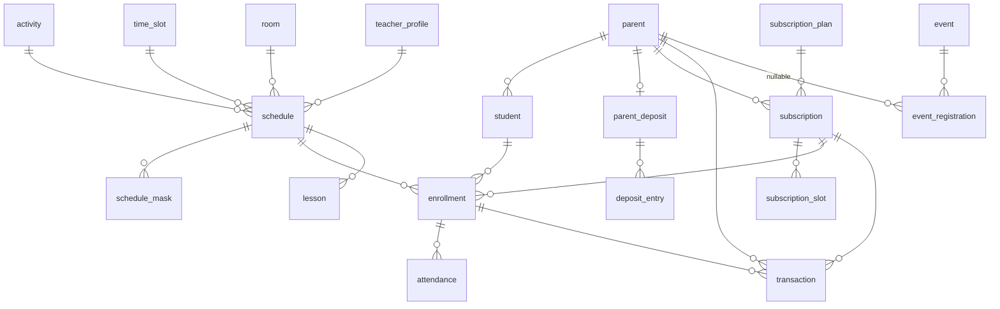

# «Улица Радости» — Схема базы данных

> **Назначение.** Текущая структура данных по доменам: ключевые поля, связи, инварианты уровня СУБД.
> **Статус.** Актуальный — соответствует реализации. Детальный источник истины — модели
> в `apps/*/models.py` и миграции; при расхождении прав код, а этот документ чинится.
> Проектная (дореализационная) версия схемы — `schema-legacy.md`.
> **Связанные документы.** `schema-audit.md` (исходная диагностика), `schema-refactoring.md`
> (план, по которому это строилось), `project-context.md`.

Деньги везде в копейках (integer). День недели: 0 = Пн … 6 = Вс.

```mermaid
erDiagram
    parent ||--o{ student : ""
    parent ||--o| parent_deposit : ""
    parent_deposit ||--o{ deposit_entry : ""
    activity ||--o{ schedule : ""
    time_slot ||--o{ schedule : ""
    room ||--o{ schedule : ""
    teacher_profile ||--o{ schedule : ""
    schedule ||--o{ schedule_mask : ""
    parent ||--o{ subscription : ""
    subscription_plan ||--o{ subscription : ""
    subscription ||--o{ subscription_slot : ""
    subscription ||--o{ enrollment : ""
    student ||--o{ enrollment : ""
    schedule ||--o{ enrollment : ""
    enrollment ||--o{ attendance : ""
    parent ||--o{ transaction : ""
    subscription ||--o{ transaction : ""
    enrollment ||--o{ transaction : ""
    schedule ||--o{ lesson : ""
    event ||--o{ event_registration : ""
    parent ||--o{ event_registration : "nullable"
```

---

## users — люди и вход

**parent** — кастомная модель пользователя (AUTH_USER_MODEL). `email` (unique, логин),
`full_name`, `phone` (PhoneNumberField), `referral_source` («откуда узнали», enum-строка,
пусто до анкеты; `UNKNOWN` — у всех, у кого поле было пустым на момент миграции
`users.0005`), `pd_consent_at` (дата согласия на обработку ПД из анкеты, `NULL` —
не давалось), `comments`, `is_active`, `is_staff`. Паролей у
родителей нет (unusable password), пароль есть только у staff для входа в админку.
Анкета заполнена, когда непусты `full_name`, `phone`, `referral_source` и `pd_consent_at`
— вычисляется на лету (`Parent.is_profile_completed`), флага в БД нет (`auth-flow.md` §4.1).

**student** — `parent` FK (CASCADE), `full_name`, `school_grade`, `dob`, `health_issues`,
`archived_at` (мягкое удаление родителем, `NULL` — активен). Физически ребёнка с историей
не удалить: `enrollment.student` — `PROTECT`, и это учёт. Архивный скрыт из профиля и
чекаута (`Student.objects.active()`), в админке и истории покупок виден.
Уникальность `(parent, full_name, dob)` только среди неархивных
(`uq_student_active_per_parent_name_dob`, partial `WHERE archived_at IS NULL`) — защита от
дабл-сабмита формы; удалённого ребёнка можно добавить заново.
`health_issues` — сведения о здоровье, специальная категория ПД (`personal-data.md` §5).

**personal_data_consent** (`users_personaldataconsent`) — журнал согласий на обработку ПД,
только добавление: `purpose` (анкета / звонок / обратная связь / событие),
`document_version`, `parent` FK (SET_NULL — доказательство переживает удаление аккаунта),
снимок `email`/`phone`, `source_id` (id заявки в таблице по `purpose`, без FK), `ip`,
`user_agent`, `created_at`. Индексы `(parent, created_at DESC)` и `(purpose, source_id)`.
Детали — `personal-data.md`.

**magic_tokens** — OTP-коды входа: `email`, `code` (6 цифр), `attempts_count`,
`expires_at`, `is_used`, `created_at` (по нему cooldown 60 с). Составные индексы
`(is_used, expires_at)` и
`(email, -created_at)` под выборку последнего кода и чистку протухших.

**teacher_profile** — 1:1 к пользователю: `middle_name`, `photo_url`, `position`,
`quote`, `bio`.

## catalog

**activity** — кружок/услуга: `name`, `slug` (unique), `category`, `price`,
`cover_image`, `short_description`, `description`, `features` (JSON), `tags` (JSON),
`is_active`, `is_featured`.

## schedule — сетка и коллизии

**room** — кабинет: `name`, `is_active`.

**time_slot** — `day_of_week`, `start_time`, `end_time` + check-констрейнты корректности интервала.

**schedule** — группа: FK `activity`, `time_slot`, `teacher` (nullable), `room` (nullable);
`group_name`, `max_capacity`, `age_min`/`age_max`, `is_active` и денормализованные
`day_of_week`, `start_time`, `end_time` — заполняются триггером БД, поэтому переживают
`bulk_create` и `QuerySet.update`. Два GiST exclusion-констрейнта запрещают пересечение
времени у преподавателя и у кабинета: время суток якорится к константной дате
(`tsrange`), интервалы полуоткрытые `[)` — смежные занятия 16:00–17:00 и 17:00–18:00
не конфликтуют.

**schedule_mask** — разовое исключение: `schedule` FK, `target_date`, `type`
(`CANCELLATION` / `RESCHEDULE`), `new_day_of_week` / `new_start_time` / `new_end_time` /
`new_room` / `new_teacher` (nullable — частичный перенос наследует исходные значения).
Уникальность `(schedule, target_date)`. Создание только через сервис
`create_schedule_mask` — валидация коллизий под advisory-локами, поэтому маски
намеренно не редактируются из админки.

## billing — деньги

**subscription_plan** — тариф: `name`, `slots_count`, `price`, `base_session_price`
(база возврата остатка на депозит — базовая цена занятия без скидки тарифа, 1 200 ₽
у всех тарифов; правится в админке), `is_unlimited`, `is_active`.
Ограничения: `slots_count ≥ 1`, цены ≥ 0; один активный обычный тариф на каждое
`slots_count` и один активный безлимит (partial unique) — чекаут и витрина выбирают
тариф однозначно. Заменить тариф: снять старый с продажи, затем завести новый.

**subscription** — купленный абонемент: `parent`, `plan`, `status`
(`PENDING` / `ACTIVE` / `EXPIRED` / `CANCELED`; в модели есть и `DRAFT` — не
используется, абонемент создаётся сразу `PENDING`), `purchase_price` и
`base_session_price` — снапшоты на момент покупки (смена тарифа не трогает купленное),
`start_date`, `expires_at` — месяц от первого фактического занятия.

**subscription_slot** — фишки по конкретному слоту: `subscription` FK, `slot_id`
(id из домена schedule, намеренно без FK через границу домена), `granted_tokens`,
`remaining_tokens` (по умолчанию 4 на слот).

**transaction** — платёж: UUID PK, `parent` (nullable — только у гостевой оплаты
события), `subscription` (nullable — у пробного `NULL`), `enrollment` (nullable — бронь
пробного: по ней вебхук находит, что подтверждать; у абонемента `NULL`),
`event_registration` (nullable, `PROTECT` — бронь события; меняет её billing только
через порт `EventBookingPort`), `amount`
(ожидаемая сумма к оплате картой), `received_amount` (nullable — сколько фактически
пришло по подтверждённому платежу; `NULL` = успешной оплаты ещё не было; на неё
делается возврат и по ней повторный вебхук не ставит возврат второй раз),
`external_id` (id платежа ЮКассы, unique), `status`
(`PENDING` / `SUCCEEDED` / `CANCELED` / `FAILED`), `selected_slot_ids` (JSON),
`metadata` (JSONB, аудит сверки), `requires_compensation` с partial-индексом
(очередь возвратов), `compensation_claimed_until` — lease claim-check процессора
возвратов, `payment_recheck_until` с partial-индексом — очередь досверки: заказ снят
по TTL, а платёж в ЮКассе ещё открыт (`api-core-contracts.md` §2.2),
`refund_id` и `refund_status` (`PENDING` / `SUCCEEDED` / `CANCELED` —
статусы ЮКассы, `FAILED` — не отправлен, `MANUAL` — закрыт менеджером). По
`refund_status` опрашиваются незавершённые возвраты и строится экран ручного
разбора, поэтому он в колонке, а не в `metadata`.
Ограничения: `ck_billing_tx_single_target` — у платежа ровно одна цель (абонемент,
пробное или бронь события), `parent` пуст только у события;
`uq_billing_tx_per_event_registration` — не больше одного платежа на бронь события
(частичный unique; он же индекс поиска по брони).

**enrollment** — запись ребёнка в группу: `student`, `subscription`, `schedule`,
`status` (`HELD` — бронь на время оплаты, `ENROLLED`, `CANCELED`). HELD старше TTL
транзакции (15 мин) считается протухшей и сразу перестаёт занимать место в подсчёте;
статус `CANCELED` ей ставит следующий чекаут в этот слот или свипер, снимая транзакцию.
`type` — `REGULAR` (по абонементу) или `TRIAL` (пробное: `trial_date`, `activity`,
без `subscription`; форму строки держит `ck_billing_enrollment_type_shape`).

Жизненный цикл: `HELD` → `ENROLLED` после оплаты, `HELD`/`ENROLLED` → `CANCELED`
при протухшей брони, возврате или истечении абонемента. Пробное после визита
**остаётся `ENROLLED`** — конечного статуса «прошло» пока нет, и на этом держится
лимит пробных.

Уникальность живых (`HELD`/`ENROLLED`) записей:

- `uq_billing_active_regular_per_student_slot` — одна постоянная запись ребёнка
  в группе. Пробные в условие не входят: иначе прошедшее пробное навсегда закрывало
  бы покупку абонемента в ту же группу.
- `uniq_trial_per_student_per_activity` — одно пробное на ребёнка по кружку.
- Пробное в группу, где у ребёнка уже есть живая постоянная запись, запрещено
  в сервисе (`create_trial_payment`, под advisory-локом слота), не в БД.
  Обратное разрешено: абонемент в группу после пробного (и до него — тогда на дату
  пробного ребёнок занимает два места).

**attendance** — посещаемость: `enrollment` FK, `date`, `status`
(`ATTENDED` / `ABSENT_ERR` / `ABSENT_OK`), `token_debited` — идемпотентность списания
фишки, `comment`, `comment_tag` (тональность). Смена статуса и движение фишки — одна
транзакция.

**idempotency_record** — идемпотентность чекаута: `key` PK, `request_fingerprint`,
`response_status` / `response_body`, `locked_until` + `lock_token` (резервация
обработки), TTL сутки.

**parent_deposit** / **deposit_entry** — несгораемый остаток: баланс 1:1 к родителю и
знаковый журнал движений (`reason`: списание на чекаут, возврат при отмене заказа,
кредит при истечении абонемента) со ссылками на транзакцию и абонемент. Уникальные
констрейнты журнала защищают от двойного начисления при ретраях.

Все деньги — `integer` в копейках. CHECK на неотрицательность есть только у
`parent_deposit.balance` и `subscription_slot.remaining_tokens`; у цен тарифа,
`purchase_price`, `transaction.amount` / `received_amount` и у `slots_count >= 1` его
пока нет — известный пробел, добавить отдельной миграцией.

## journal

**lesson** — материализованное занятие: `schedule` FK, `date`, `topic`. Уникальность
`(schedule, date)`. Создаётся утренним таском; посещаемость генерируется по записанным
автоматически, учитель только снимает отсутствующих.

## events

**event** — `title`, `description`, `cover_image`, `start_datetime`,
`duration_minutes`, `price` (0 = бесплатно), `capacity`, `seats_taken` —
денормализованный счётчик под `select_for_update`. Check-констрейнты: `price >= 0`,
`capacity >= 1`; `seats_taken` неотрицателен (`PositiveIntegerField`). Ограничения
`seats_taken <= capacity` в БД нет: менеджер может уменьшить вместимость ниже уже
занятых мест — новые брони тогда не пройдут проверку сервиса, а остаток
(`Event.seats_free`) покажет 0, а не отрицательное число.

**event_registration** — гостевая запись: `event` FK (`PROTECT`), `parent` (nullable —
единственное анонимное действие в системе; при удалении родителя обнуляется), контакты,
`attendees_count`, `amount` — снимок суммы брони в копейках (цена × места в момент
записи, у бесплатной 0; `CHECK amount >= 0`; старые брони заполнены миграцией по цене
на момент выкладки), `source`, `comment`, `status` (`PENDING_PAYMENT` / `CONFIRMED` /
`CANCELED`; `NEW` объявлен, но не выставляется). Частичный уникальный индекс
`uq_event_registration_active_phone` — одна живая запись на телефон в событии.

Срок жизни `PENDING_PAYMENT`: бронь с онлайн-платежом (есть `transaction`) живёт как
неоплаченная транзакция — 15 минут, снимает свипер оплат после сверки с ЮКассой. Старая
бронь «оплата на месте» (без транзакции) — `EVENT_PENDING_PAYMENT_TTL_MINUTES`, снимает
свипер событий. Снятие освобождает места и телефон.

## public_forms / content

**callback_request** — имя, телефон, `preferred_time_window`, `status`; история
изменений через django-simple-history.

**feedback_request** — имя (опционально), `email`, `message`, `status`; тоже с историей.

**gallery_image** — `image_url`, `order`, `is_published`.
